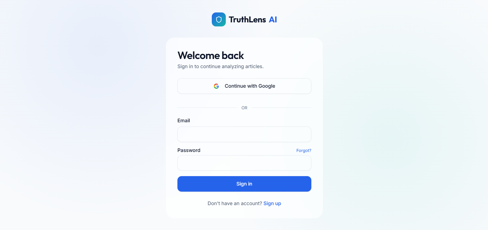
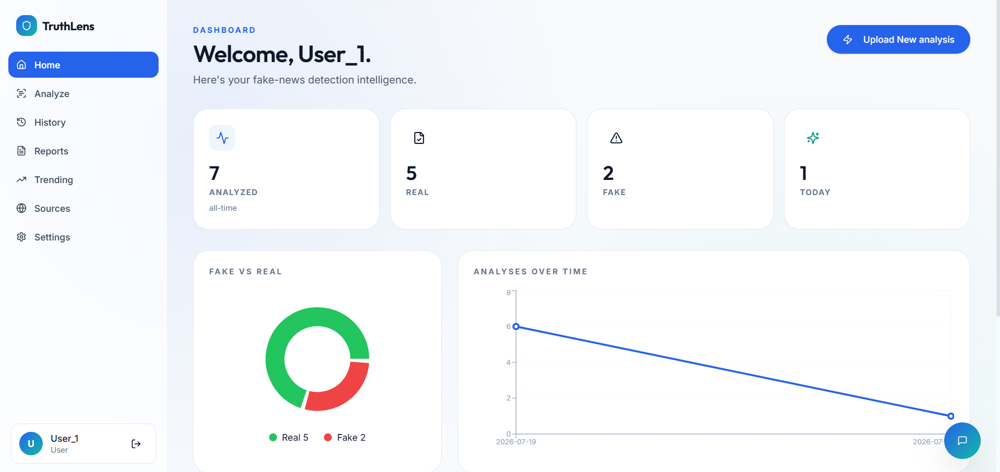
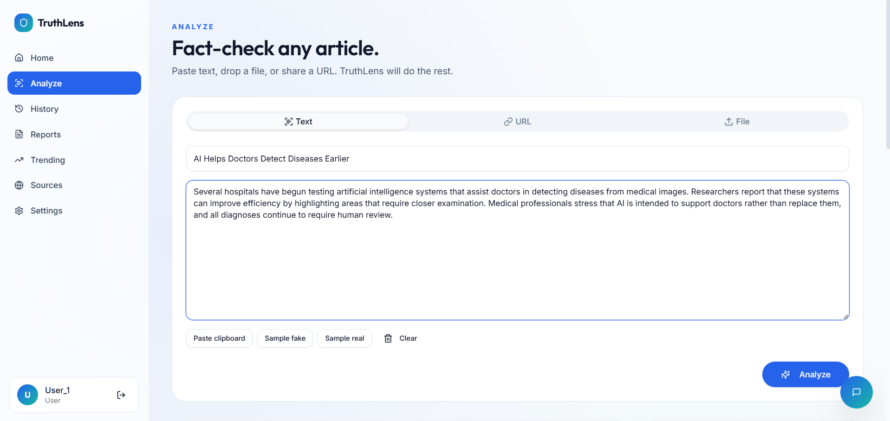
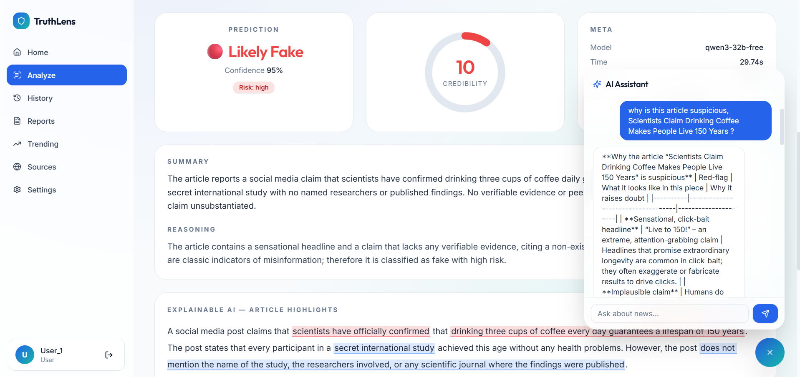
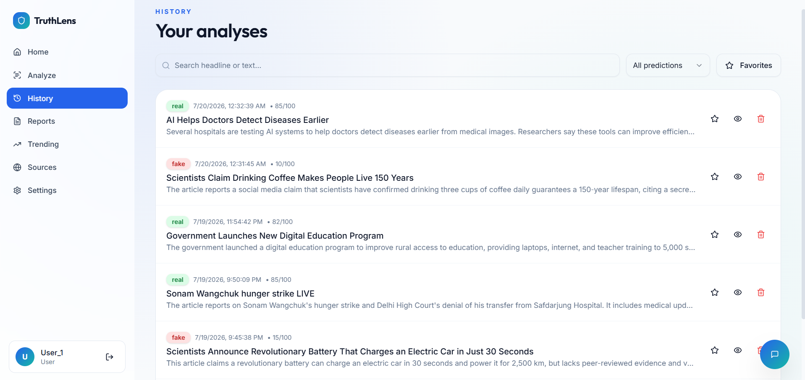
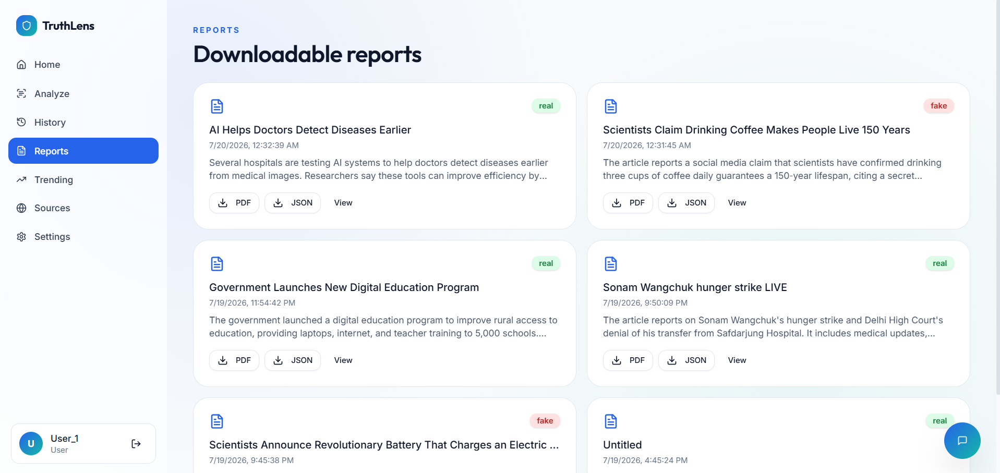

<div align="center">

# 🧠 TruthLens AI

### AI-Powered Fake News Detection & Credibility Analysis Platform


### Detect misinformation using Open-Source Large Language Models (LLMs)

---

## 🌐 Live Demo

**Frontend:**  
https://truth-lens-ai-nine.vercel.app/

**Backend API:**  
https://truthlens-ai-backend-ldbq.onrender.com

**Swagger Documentation:**  
https://truthlens-ai-backend-ldbq.onrender.com/docs

</div>

---

# 📖 Table of Contents

- Overview
- Motivation
- Key Use Cases
- Core Features
- Workflow
- Architecture
- Tech Stack
- Project Structure
- Installation
- Environment Variables
- Deployment
- API Endpoints
- Testing
- Security
- Screenshots
- Assumptions & Limitations
- Future Improvements
- Contributing
- License

---

# 📖 Overview

TruthLens AI is an AI-powered fake news detection and credibility analysis platform designed to help users determine whether online news content is trustworthy or potentially misleading.

The platform leverages open-source Large Language Models (LLMs) through the OpenRouter API to analyze news articles and generate credibility scores, confidence levels, AI-generated summaries, detailed reasoning, suspicious claim detection, and actionable recommendations.

Users can analyze news using plain text, article URLs, or uploaded documents while maintaining a personalized history of previous analyses. An integrated AI Chat Assistant enables users to ask follow-up questions and better understand the AI's decisions.

The goal of TruthLens AI is not to replace human judgment but to assist users in making more informed decisions when consuming digital information.

---

# 🎯 Motivation

The rapid spread of misinformation across social media and digital news platforms has made it increasingly difficult for people to distinguish factual information from misleading or manipulated content.

False information can influence public opinion, create panic, spread rumors, and affect critical decisions in areas such as healthcare, education, finance, and politics.

TruthLens AI was developed to address this challenge by providing an intelligent AI-powered assistant that evaluates news credibility, explains its reasoning transparently, and encourages users to think critically before trusting or sharing information.

---

# 🎯 Key Use Cases

TruthLens AI can be used in a variety of real-world scenarios, including:

- 📰 Verifying online news articles before sharing them.
- 🎓 Helping students evaluate the credibility of research sources.
- 👨‍💼 Assisting journalists with preliminary credibility assessment.
- 🏢 Supporting organizations in identifying potentially misleading information.
- 📱 Helping everyday users quickly assess online news credibility.
- 📑 Generating downloadable AI-powered credibility reports for documentation and reference.

---

# ✨ Core Features

| Feature | Status |
|----------|--------|
| User Authentication | ✅ |
| Fake News Detection | ✅ |
| Credibility Score | ✅ |
| Confidence Score | ✅ |
| AI Generated Summary | ✅ |
| AI Reasoning | ✅ |
| Suspicious Claims Detection | ✅ |
| URL Analysis | ✅ |
| PDF Upload | ✅ |
| DOCX Upload | ✅ |
| TXT Upload | ✅ |
| AI Chat Assistant | ✅ |
| Download PDF Report | ✅ |
| Dashboard | ✅ |
| History | ✅ |
| Favorites | ✅ |
| MongoDB Storage | ✅ |
| Responsive UI | ✅ |

---

# 🔄 Workflow

1. User registers or logs into the platform.
2. User submits news through plain text, a news URL, or an uploaded document.
3. The backend extracts and preprocesses the article content.
4. The OpenRouter API sends the request to the selected open-source Large Language Model.
5. The AI generates:
   - Prediction
   - Credibility Score
   - Confidence Score
   - Summary
   - Detailed Reasoning
   - Suspicious Claims
   - Recommendations
6. The analysis is securely stored in MongoDB Atlas.
7. Users can interact with the AI Chat Assistant for additional clarification.
8. PDF reports can be generated and downloaded for future reference.

---

# 🏗️ Architecture

```text
                    +-----------------------+
                    |    React Frontend     |
                    |       (Vercel)        |
                    +-----------+-----------+
                                |
                                |
                                ▼
                    +-----------------------+
                    |   FastAPI Backend     |
                    |      (Render)         |
                    +-----------+-----------+
                                |
                +---------------+---------------+
                |                               |
                ▼                               ▼
      +------------------+          +-----------------------+
      | MongoDB Atlas    |          | OpenRouter API        |
      | User Database    |          | AI Reasoning Model    |
      +------------------+          +-----------------------+
```

---

# 🛠️ Tech Stack

## Frontend

- React 19
- React Router
- Tailwind CSS
- ShadCN UI
- Axios
- Framer Motion
- Recharts

## Backend

- FastAPI
- Python
- JWT Authentication
- bcrypt
- Motor
- ReportLab
- PyPDF
- python-docx

## Artificial Intelligence

- OpenRouter API
- Qwen3 32B (Free Model)
- Open-source Large Language Models (LLMs)

## Database

- MongoDB Atlas

## Deployment

- Vercel
- Render

---

# 📂 Project Structure

```text
TruthLens-AI
│
├── backend
│   ├── server.py
│   ├── requirements.txt
│   └── .env
│
├── frontend
│   ├── src
│   ├── public
│   └── package.json
│
├── docs
├── memory
├── tests
└── README.md
```

---

# 🚀 Installation

## 1. Clone Repository

```bash
git clone https://github.com/anushkachaudhari1001/TruthLens-AI.git

cd TruthLens-AI
```

---

## 2. Backend Setup

```bash
cd backend

pip install -r requirements.txt

uvicorn server:app --reload
```

Backend

```
http://127.0.0.1:8000
```

Swagger Documentation

```
http://127.0.0.1:8000/docs
```

---

## 3. Frontend Setup

```bash
cd frontend

npm install

npm start
```

Frontend

```
http://localhost:3000
```

---

# ⚙️ Environment Variables

Create a `.env` file inside the **backend** folder.

```env
MONGO_URL=your_mongodb_connection_string

DB_NAME=truthlens_ai

JWT_SECRET=your_secret_key

OPENROUTER_API_KEY=your_openrouter_api_key

CORS_ORIGINS=http://localhost:3000,https://truth-lens-ai-nine.vercel.app
```

---

# ☁️ Deployment

The application is deployed using free cloud services.

| Component | Platform |
|------------|----------|
| Frontend | Vercel |
| Backend | Render |
| Database | MongoDB Atlas |
| AI Model | OpenRouter |

### Live Deployment

**Frontend**

https://truth-lens-ai-nine.vercel.app/

**Backend**

https://truthlens-ai-backend-ldbq.onrender.com

**Swagger API**

https://truthlens-ai-backend-ldbq.onrender.com/docs

---

# 📡 API Endpoints

| Endpoint | Method | Description |
|----------|--------|-------------|
| `/api/register` | POST | Register a new user |
| `/api/login` | POST | Authenticate user |
| `/api/analyze` | POST | Analyze news article |
| `/api/chat` | POST | Chat with AI Assistant |
| `/api/history` | GET | Retrieve analysis history |
| `/api/history/{id}` | DELETE | Delete analysis |
| `/api/report/{id}` | GET | Download PDF report |
| `/api/favorites` | GET | Retrieve favorite analyses |

---

# 🧪 Testing Checklist

The following functionality has been tested successfully:

- ✅ User Registration
- ✅ User Login
- ✅ JWT Authentication
- ✅ Analyze Plain Text
- ✅ Analyze News URL
- ✅ Upload PDF
- ✅ Upload DOCX
- ✅ Upload TXT
- ✅ AI Fake News Detection
- ✅ AI Chat Assistant
- ✅ Download PDF Report
- ✅ Analysis History
- ✅ Favorites
- ✅ Delete History
- ✅ Responsive User Interface

---

# 🔒 Security

TruthLens AI follows several security best practices:

- JWT-based Authentication
- Password Hashing using bcrypt
- Protected API Endpoints
- Environment Variables for Sensitive Keys
- MongoDB Atlas Authentication
- CORS Protection
- Secure Password Storage
- Token-based User Sessions

---

# 📸 Screenshots

## 🏠 Landing Page


---

## 🔐 Login Page



---

## 📊 Dashboard



.png)

---

## 📰 News Analysis



.png)

.png)

---

## 🤖 AI Chat Assistant



.png)

---

## 📜 History



---

## 📄 PDF Report



---

# ⚠️ Assumptions & Limitations

### Assumptions

- Users provide readable news content or accessible URLs.
- Internet connectivity is available for AI inference through OpenRouter.
- MongoDB Atlas remains accessible during runtime.
- The selected open-source AI model is available through the OpenRouter API.

### Current Limitations

- AI predictions should be treated as decision-support rather than absolute truth.
- The platform currently relies on LLM reasoning instead of real-time external fact-checking databases.
- Some websites may restrict article extraction.
- Performance depends on the response time of external AI APIs.
- Free-tier cloud deployments (Render and Vercel) may experience cold starts after periods of inactivity.

---

# 🚀 Future Improvements

The following enhancements are planned for future versions:

- 🌍 Multi-language Support
- 🌐 Browser Extension
- 📱 Mobile Application
- 🖼 OCR Support for Images
- 🎙 Voice-based News Analysis
- 🔗 Integration with Live Fact-check APIs
- 🤖 Multiple AI Model Selection
- 📊 Explainable AI Visualizations
- ⭐ Source Reputation Database
- 🔔 Real-time Fake News Alerts
- 👥 Collaborative Fact Verification

---

# 👩‍💻 Developer

**TruthLens AI** was developed as a hackathon project to demonstrate the practical application of Artificial Intelligence in combating misinformation.

The project combines modern web technologies with open-source Large Language Models to deliver an interactive platform capable of analyzing news credibility, generating AI-powered explanations, and assisting users in making informed decisions.

**Technology Stack**

- React 19
- FastAPI
- Python
- MongoDB Atlas
- OpenRouter API
- Qwen3 32B (Free LLM)
- Tailwind CSS
- Render
- Vercel

---

# 🤝 Contributing

Contributions are welcome.

1. Fork the repository.
2. Create a new feature branch.
3. Commit your changes.
4. Push the branch.
5. Open a Pull Request.

---

# 📄 License

This project is licensed under the MIT License.

---

<div align="center">

## ⭐ If you found this project useful, please consider giving it a Star!

### TruthLens AI

**Helping users identify misinformation through AI-powered credibility analysis.**

Built with ❤️ using React, FastAPI, MongoDB Atlas, OpenRouter, Render, and Vercel.

</div>